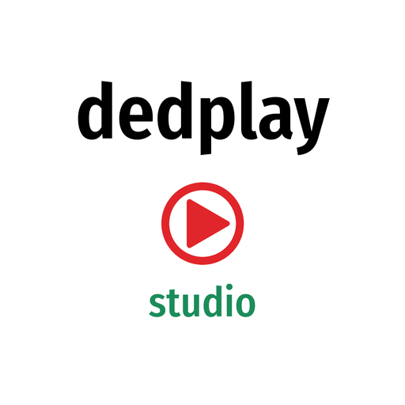

# Dedplay Studio



Kitabı bir kez ver, gerisini Stüdyo halleder:

1. Kitap Türkçe değilse **Dedplay Translate** Türkçeye çevirir.
2. Çeviri bitince (ya da kitap zaten Türkçeyse hemen) **Dedplay Kitap Okuma** seslendirir,
   aynı anda **Osmanlıca çevirici** temiz metin parçalarını Osmanlıcaya aktarır.
3. Sonuç: M4B sesli kitap + Türkçe, Osmanlıca ve iki dilli EPUB / PDF / Word.
   Hepsi çıktı klasöründe kitap adıyla açılan klasöre kendiliğinden kaydedilir.

## Kurulum 1: Hepsi bir arada (önerilen)

`docker-compose.stack.yml` tek seferde beş uygulamayı kurar:
Stüdyo (8070), Translate (8060), Kitap Okuma (8020), Osmanlıca çevirici (8089) ve Ollama.

**ZimaOS:** Uygulama Mağazası → Özel Kurulum → İçe aktar → `docker-compose.stack.yml`
dosyasının içeriğini yapıştır.

**Terminal:**
```bash
mkdir -p /DATA/AppData/dedplay-studyo && cd /DATA/AppData/dedplay-studyo
curl -L -o docker-compose.yml https://raw.githubusercontent.com/berzahbey/dedplay-studyo/main/docker-compose.stack.yml
docker compose up -d
```

### Kurulumda neyi seçmeliyim?

YAML'ın en üstündeki **sadece iki satırı** kendine göre değiştir:

| Ayar | Ne işe yarar? | Varsayılan |
|---|---|---|
| **Kitap klasörü** (`kitap:`) | Okunacak/çevrilecek kitapların durduğu klasör. "Sunucudan seç" bölümünde bu görünür. Uygulamalar buraya yazmaz. | `/media/ZimaOS-HD/Kitap` |
| **Çıktı klasörü** (`cikti:`) | Biten her kitap için burada bir klasör açılır: sesli kitap + bütün dosyalar. Audiobookshelf kullanıyorsan onun okuduğu klasörü seç. | `/media/ZimaOS-HD/Media/Music/audio` |

Geri kalan her şey (veritabanları, çeviri modeli, ses modelleri) otomatik olarak
`/DATA/AppData/dedplay-studyo/` altında oluşur. Portlar doluysa `ports:` satırlarındaki
sol taraftaki sayıyı değiştir.

İlk açılışta çeviri modeli (~8 GB) ve Osmanlıca çevirici modeli (~5 GB) iner.

## Kurulum 2: Sadece Stüdyo (diğerleri ayrı kuruluysa)

```bash
git clone https://github.com/berzahbey/dedplay-studyo.git /DATA/AppData/dedplay-studyo/kaynak
cd /DATA/AppData/dedplay-studyo/kaynak
docker compose up -d --build
```

`docker-compose.yml` içindeki `TRANSLATE_URL`, `OKUMA_URL`, `OSMANLICA_URL` diğer
uygulamaların adresleridir.

Adres: `http://<sunucu-ip>:8070`
