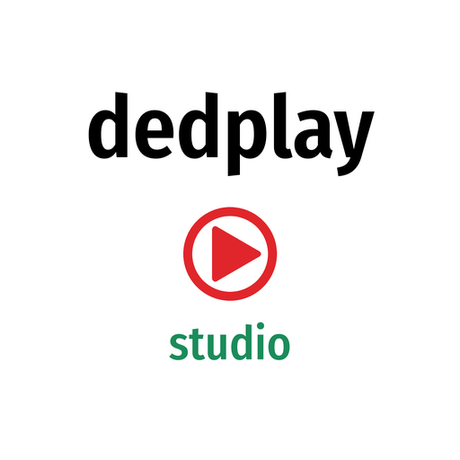

# Dedplay Studio



Kitabı ya da metni bir kez ver, gerisini Stüdyo halleder (Dedplay Kütüphane 5 Ekim 2026'dan beri Stüdyo'nun parçası):

1. **Kütüphane** metni çıkarır (taranmış PDF'te Surya OCR), temizler, başlık/dipnot/sayfa yapısını kurar ve EPUB üretir;
   okuma ekranında okuyup düzeltebilirsin.
2. **Kitap Okuma** seslendirir, **Osmanlıca çevirici** Osmanlıcaya aktarır.
3. Sonuç: M4B sesli kitap + Türkçe, Osmanlıca ve iki dilli EPUB / PDF / Word / HTML / TXT.

Yalnız Türkçe kitaplar seslendirilir ve Osmanlıcaya aktarılır (çeviri yok). OpenITI'den eklenen Arapça eserler
Arapça EPUB olarak kalır.

## Kurulum 1: Hepsi bir arada (önerilen)

`docker-compose.stack.yml` tek seferde dört uygulamayı kurar:
Stüdyo (8070, Kütüphane dahil), Kitap Okuma (8020), Osmanlıca çevirici (8089) ve Ollama.

**ZimaOS:** Uygulama Mağazası → Özel Kurulum → İçe aktar → `docker-compose.stack.yml`
dosyasının içeriğini yapıştır.

**Terminal:**
```bash
mkdir -p /DATA/AppData/dedplay-studyo && cd /DATA/AppData/dedplay-studyo
curl -L -o docker-compose.yml https://raw.githubusercontent.com/berzahbey/dedplay-studyo/main/docker-compose.stack.yml
docker compose up -d
```

### Kurulumda neyi seçmeliyim?

YAML'ın en üstündeki **sadece iki satırı** kendine göre değiştir:

| Ayar | Ne işe yarar? | Varsayılan |
|---|---|---|
| **Kitap klasörü** (`kitap:`) | Eklenecek kitapların durduğu klasör. "Sunucudan seç" bölümünde bu görünür. Uygulamalar buraya yazmaz. | `/media/ZimaOS-HD/Kitap` |
| **Çıktı klasörü** (`cikti:`) | Biten her kitap için burada bir klasör açılır: sesli kitap + bütün dosyalar. Audiobookshelf kullanıyorsan onun okuduğu klasörü seç. | `/media/ZimaOS-HD/Media/Music/audio` |

Geri kalan her şey (veritabanları, OCR ve ses modelleri) otomatik olarak
`/DATA/AppData/dedplay-studyo/` altında oluşur. Portlar doluysa `ports:` satırlarındaki
sol taraftaki sayıyı değiştir.

İlk açılışta Osmanlıca çevirici modeli (~5 GB) ve ilk taranmış kitapta Surya OCR modelleri iner.

### İşlemci sınırı hakkında

ZimaOS "Özel Kurulum"da uygulamalara kendiliğinden 1 çekirdek sınırı koyabiliyor. Stack'teki
`islemci-ayari` servisi bunu dakikada bir kontrol eder ve sınırı sunucunun bütün çekirdeklerine
çıkarır. Elle bir şey yapmana gerek yok. Durumu görmek için: `docker logs dedplay-islemci-ayari`

## Kurulum 2: Sadece Stüdyo (diğerleri ayrı kuruluysa)

```bash
git clone https://github.com/berzahbey/dedplay-studyo.git /DATA/AppData/dedplay-studyo/kaynak
cd /DATA/AppData/dedplay-studyo/kaynak
docker compose up -d --build
```

`docker-compose.yml` içindeki `OKUMA_URL`, `OSMANLICA_URL` diğer
uygulamaların adresleridir.

Adres: `http://<sunucu-ip>:8070`
